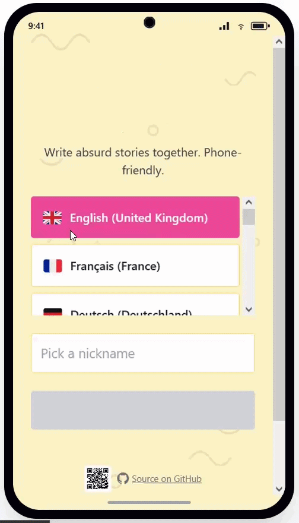
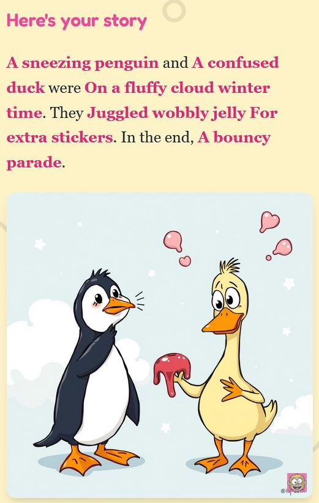

# Funny Stories

<table>
<tr>
<td width="220" valign="middle">

</td>
<td valign="middle">
A party game where 3–7 friends, on their phones, answer 7 silly questions about a shared story they can't see — then watch an AI cartoon goof of the result (+short video). 
Multilingual from day one. 
No accounts, no database, no analytics. Self-hostable for free. 
Runs on a free Cloudflare Workers AI.
</td>
</tr>
</table>

## How it plays

- **Create a room.** One person taps **Create room**, picks a language, and shares a 6-character code or QR.
- **Friends join.** They scan the QR or enter the code, pick a nickname; the host taps **Start Game**.
- **Answer seven questions.** Each round, one prompt — *Who? And who else? Where? When? What did they do? What for? What happened in the end?*
- **Stay in the dark.** The story rotates every round, so you never see the other answers in your own story.
- **Reveal the cartoon.** After seven rounds, your story will be turned into a goofy AI cartoon (+short video).

  
  
  
  

## Deploy your own (free, ~5 minutes)

You deploy onto **your own** GitHub, Cloudflare + Render accounts — both free, no credit card. (You could sign in with your Google account — just seconds).

**Step 1. Make a shared secret string (let's call it "S")** (40+ chars). You will need it in steps 2 and 3.
> On a phone: use a password-manager app — or type your own random string (important: 40+ chars, letters/digits only).\
> On a computer: see the [docs/DEPLOYMENT.md](docs/DEPLOYMENT.md#1-generate-a-shared-secret-s).

**Step 2. Deploy the image Worker (Cloudflare) - press the button below.**

<table>
<tr>
<td width="210" valign="middle">

</td>
<td valign="middle">

*Safe to click:* this deploys the repo's open-source Worker — a single 92-line [`worker.js`](./cloudflare/worker.js) you can read in a minute — into **your own** Cloudflare account via Cloudflare's official button. It runs only on your account; nothing is sent to the authors.

</td>
</tr>
</table>

> After it deploys, set `WORKER_SECRET = S`(no quotes) in the Worker's **Settings → Variables** (the button can't do this — until you do, it returns 403). Copy the **Worker URL** it gives you.

**Step 3. Deploy the game server (Render) - press the button below.**

<table>
<tr>
<td width="210" valign="middle">

</td>
<td valign="middle">

*Safe to click:* this builds the repo's open-source [`server/`](./server) on **your own** Render account via Render's official button. You own it and can delete it anytime — no telemetry, and nothing runs on the authors' servers.

</td>
</tr>
</table>

> When Render prompts for environment variables, paste:
>
> | Variable | Value |
> |---|---|
> | `CLOUDFLARE_WORKER_URL` | the **Worker URL** from Step 2 |
> | `CLOUDFLARE_WORKER_SECRET` | (no quotes)**"S"** (the *same* string from Step 1) |

First build takes ~3 minutes. Open your `<custom>.onrender.com` URL on a phone and play.

> **If every phone shows "Generation failed,"** the two secrets don't match — re-check steps 2 and 3. The free Render tier also sleeps when idle, so the first visit after a quiet period is slow.

## Documentation

| Guide | What's in it |
|---|---|
| [docs/DEPLOYMENT.md](./docs/DEPLOYMENT.md) | Full deploy: Render, Docker, the Cloudflare Worker, KV, and gotchas. |
| [docs/DEVELOPMENT.md](./docs/DEVELOPMENT.md) | Local dev, toolchain, scripts, layout, tests, limitations. |
| [docs/LANGUAGES.md](./docs/LANGUAGES.md) | Adding a language; image-prompt translation. |
| [docs/MODERATION.md](./docs/MODERATION.md) | Moderation, operator responsibility, visual artefacts. |
| [docs/CUSTOMIZATION.md](./docs/CUSTOMIZATION.md) | Logo stamp, fork rebranding, screenshots. |
| [CONTRIBUTING.md](./docs/CONTRIBUTING.md) | How to work on the project. |
| [CODE_OF_CONDUCT.md](./CODE_OF_CONDUCT.md) | Community expectations. The short version: be decent. |

## License

[AGPL-3.0](./LICENSE). Deploy a modified version on a network service and you must offer its source to that service's users. Want different terms? Open an issue.
