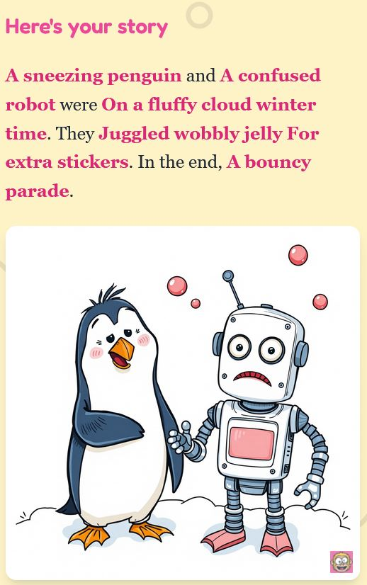

# Funny Stories

<table>
<tr>
<td width="220" valign="middle">

</td>
<td valign="middle">
A party game where 3–7 friends, on their phones, answer 7 silly questions about a shared story they can't see — then watch an AI cartoon goof of the result (+short video). 
Multilingual from day one. 
No accounts, no database, no analytics. Self-hostable for free.
</td>
</tr>
</table>

## How it plays

- **Create a room.** One person taps **Create room**, picks a language, and shares a 6-character code or QR.
- **Friends join.** They scan the QR or enter the code, pick a nickname; the host taps **Start**.
- **Answer seven questions.** Each round, one prompt — *Who? And who else? Where? When? What did they do? What for? What happened in the end?*
- **Stay in the dark.** The story rotates every round, so you never see the other answers in your own story.
- **Reveal the cartoon.** After seven rounds, your story will be turned into a goofy AI cartoon (+short video).

  

*A finished story — click to zoom.*

## Deploy your own (free, ~5 minutes)

You deploy onto **your own** Cloudflare + Render accounts — both free, no credit card. (You sign in with your Google account — just seconds).

**1. Make a shared secret string (let's call it S)** (40+ chars). You will need it in steps 2 and 3.\
On a phone: use a password-manager app — or type your own random string. (important: 40+ chars, letters/digits only).\
On a computer, see the [handbook/DEPLOYMENT.md](handbook/DEPLOYMENT.md#1-generate-a-shared-secret-s).

**2. Deploy the image Worker (Cloudflare).**

After it deploys, set `WORKER_SECRET = S` in the Worker's **Settings → Variables** (the button can't do this — until you do, it returns 403). Copy the Worker URL it gives you.

**3. Deploy the game server (Render).**

When Render prompts for environment variables, paste:

| Variable | Value |
|---|---|
| `CLOUDFLARE_WORKER_URL` | the Worker URL from step 2 |
| `CLOUDFLARE_WORKER_SECRET` | **S** (the *same* string) |

First build takes ~3 minutes. Open your `.onrender.com` URL on a phone and play.

> **If "Generate picture" fails on every phone,** the two secrets don't match — re-check steps 2 and 3. The free Render tier also sleeps when idle, so the first visit after a quiet period is slow.

## Documentation

| Guide | What's in it |
|---|---|
| [handbook/DEPLOYMENT.md](./handbook/DEPLOYMENT.md) | Full deploy: Render, Docker, the Cloudflare Worker, KV, and gotchas. |
| [handbook/DEVELOPMENT.md](./handbook/DEVELOPMENT.md) | Local dev, toolchain, scripts, layout, tests, limitations. |
| [handbook/LANGUAGES.md](./handbook/LANGUAGES.md) | Adding a language; image-prompt translation. |
| [handbook/MODERATION.md](./handbook/MODERATION.md) | Moderation, operator responsibility, visual artefacts. |
| [handbook/CUSTOMIZATION.md](./handbook/CUSTOMIZATION.md) | Logo stamp, fork rebranding, screenshots. |
| [CONTRIBUTING.md](./CONTRIBUTING.md) | How to work on the project. |

## License

[AGPL-3.0](./LICENSE). Deploy a modified version on a network service and you must offer its source to that service's users. Want different terms? Open an issue.
